# Developer Guide

## Table of Contents

1. [Introduction](#introduction)
    1. [About CLIverShelf](#about-clivershelf)
    2. [Aim](#aim)
    3. [Target Audience](#target-audience)
2. [Setting up](#setting-up)
3. [Acknowledgements](#acknowledgements)
4. [Design](#design)
    1. [Architecture](#architecture)
    2. [UI Component](#ui-component)
    3. [Logic Component](#logic-component)
        1. [SubComponent Parser](#subcomponent-parser)
        2. [Subcomponent Command](#subcomponent-command)
            1. [Subcomponent Sales](#subcomponent-sales)
    4. [Model Component](#model-component)
    6. [Storage Component](#storage-component)
5. [Implementation](#implementation)
    1. [Adding an item](#adding-an-item)
    2. [Editing an item](#editing-an-item)
    3. [Listing all items](#listing-all-items)
    4. [Selling an item](#selling-an-item)
    5. [Generating sales report](#generating-sales-report)
    6. [Generating item markup price](#generating-item-markup-price)
6. [Product Scope](#product-scope)
7. [User stories](#user-stories)
8. [Non-Functional Requirements](#non-functional-requirements)
9. [Glossary](#glossary)
10. [Instructions for manual testing](#instructions-for-manual-testing)

## Introduction

### About CLIverShelf
Welcome to CLIverShelf!

**CLIverShelf** is a desktop command line interface-based app for bookstore owners to manage their bookstore. With
**CLIverShelf**, owners can easily keep track of their items in their shelves, and even generate a sales report so that
they know how well their business is going.

### Aim
This developer guide describes the design, implementation and architecture of **CLIverShelf**. The aim of this developer guide is
to get developers and potential contributors to get familiarised with the implementation of **CLIverShelf**.


### Target Audience
This developer guide is for developers who want to understand, test or improve the design of **CLIverShelf**.

### How to Use This User Guide
## Setting up

This section describes some pre-requisites and instructions to set up the application on your computer. Do follow the instructions closely
as any deviations may cause unexpected outcomes or cause application to not startup.

**Pre-requisites**

1. JDK 11
2. IntelliJ IDEA IDE

**Setting up the Project in Your Computer**

1. Fork [this repository](https://github.com/AY2122S1-CS2113T-F11-4/tp), and clone the fork to your computer.
2. Open up IntelliJ. If you are not at the welcome screen, click `File` > `Close Project` to close any existing project
3. Set up the correct JDK version for Gradle
    1. Click `File` > `New Project Setup` > `Structure`, and ensure `Project SDK` is using `JDK 11`. Click `OK`
4. Import the project
    1. Click `File` > `Open Project`
    2. Select the project directory, and click `OK` to accept the default settings
5. Verify the setup: After the importing is complete, locate `CLIverShelf.java` file, right-click it
   and `Run 'CLIverShelf.main()'`. If the setup is correct, you should see something like this:

```
                                                                  .............................................................
                                                                  : Hello from                                                :
                                                                  :   _____ _      _____              _____ _          _  __  :
                                                                  :  / ____| |    |_   _|            / ____| |        | |/ _| :
                                                                  : | |    | |      | |_   _____ _ _| (___ | |__   ___| | |_  :
                                                                  : | |    | |      | \ \ / / _ \ '__\___ \| '_ \ / _ \ |  _| :
                                                                  : | |____| |____ _| |\ V /  __/ |  ____) | | | |  __/ | |   :
                                                                  :  \_____|______|_____\_/ \___|_| |_____/|_| |_|\___|_|_|   :
                                                                  : What can I do for you?                                    :
                                                                  ................................................................
                                                                            ...................................................
                                                                            : Enter 'help' for the list of available commands :
                                                                            ......................................................
```

## Acknowledgements

1. [addressbook-level3](https://se-education.org/addressbook-level3/)
2. [Adapted Parser code: AddressBook (Level 2)](https://github.com/se-edu/addressbook-level2/blob/master/src/seedu/addressbook/parser/Parser.java)

## Design

This section will briefly describe the overall design and structure of major components in the CLIverShelf.

### Architecture

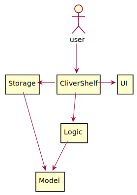

The architecture diagram above describes the design of CLIverShelf. The main components are:

1. `CLIverShelf` Responsible for initializing the various components and connecting them up with one another at app
   launch.
2. `UI`: Handles the interactions with the user.
3. `Logic`: Parses and executes the user input commands.
4. `Model`: Holds the data of the App in memory
5. `Storage`: Reads data from, and writes data to, the hard disk.

### General Program Flow

This section illustrates how the major components interact with each other during program run.

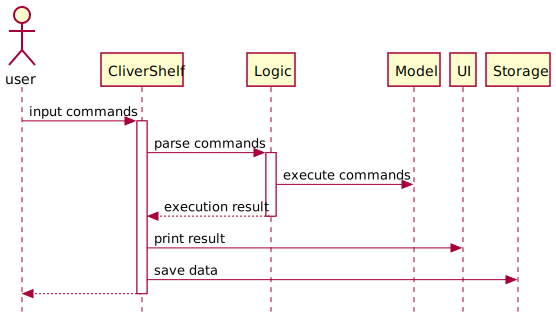

1. User runs the programs & input user commands
2. `CLIverShelf` calls `Parser` to `parseCommand()`
3. `Parser` creates and returns a `Command` object when parsed successful
4. `CLIverShelf` calls the `Command` object to `execute()`, and it returns a String `result`
5. `CLIverShelf` instantiates `UI` component to print the `result`


### UI component

The `UI` component is responsible for all the user inputs and system outputs. It is in charge of the display of success
command executions, error messages and also user interactions by prompting for the next command.

The class diagram below shows the associations between classes of the UI components

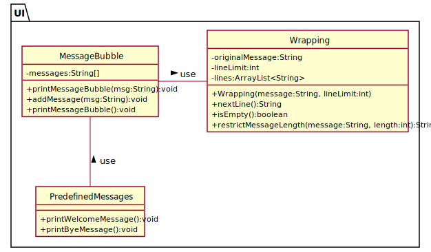

The `UI` component is made up of 2 classes:

* `MessageBubble`: Responsible for the display of messages
* `PredefinedMessages`: Holds the messages required for MessageBubble to print to console.

The sequence diagram below illustrates how message can be printed without a MessageBubble instance.

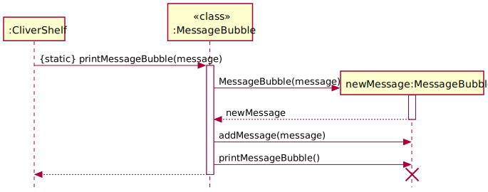

### Logic component

The class diagram below shows the associations between the classes that make up the `Logic` component.


The `Logic` component consists of `Parser`, `Command` and `Sales` components.

1. After user enters input, `UI` fetches and passes it to Parser for parsing.
2. Parser then returns a `Command` object, which is then executed.
3. The command execution directly affects the objects in the `Model` component.
4. After execution, `Command` instructs the `UI` component to print out relevant output messages (e.g successful command
   execution or error messages)
5. `Command` then checks the `ExitCommand` on whether the program should exit.
6. In the absence of `ExitCommand`, UI then takes over to prompt and process the next user input.

### Logic: Subcomponent Parser

This section will illustrate how the Parser interacts with `CLIvershelf` class and different `Command` classes.

**API**: [Parser.java](https://github.com/AY2122S1-CS2113T-F11-4/tp/blob/master/src/main/java/seedu/duke/logic/parser/Parser.java)


1. When user enters a command into the terminal, upon submission, `CliverShelf` receives the input line and calls
   the `Parser` to `parseCommand()`
2. `Parser` first checks for BASIC_COMMAND_FORMAT, to extract the 1st word in the input which is the `commandWord`
3. The commandWord would then be checked against the respective `COMMAND_STRINGS` such as `add`, `delete` , etc.
4. If the `COMMAND_WORD` matches any of the strings, the function will proceed to execute
   the `prepare{commandWord}(arguments)` function of the `Parser`
5. Lastly, when the Parsing is complete, the Parser will return the `{commandWord}Command` object to the `CliverShelf`
   component, for `CLIvershelf` to decide what to do with the `{commandWord}Command` object.

### Logic: Subcomponent Command

**API**: [Command.java](https://github.com/AY2122S1-CS2113T-F11-4/tp/blob/master/src/main/java/seedu/duke/logic/command/Command.java)

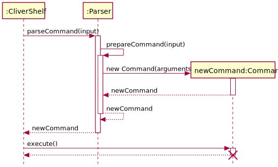

1. `Command` is an abstract class and has an abstract method `execute()`.
2. Specific commands, such as `AddCommand` or `DeleteCommand`, are the subclasses of `Command`. Each one of them is
   responsible for one function of the application, such as adding new items or deleting items.
3. Specific commands will be instantiated inside the `parseCommand(userInputLine: String): Command` method of parser
   and is then returned to the CLIverShelf after they are instantiated.
4. The CLIverShelf will call the `execute()` method of the `Command` object to execute its specific function.
5. The following sequence diagram illustrates how a general `Command` object interacts with other
   components of the system.
6. More details about specific commands will be covered in the Implementation section.

### Command: Subcomponent Sales

This section describes an overview of how the subcomponent `Sales` interacts with the sales related commands (`SellCommand`, `ReportCommand`, `MarkUpCommand`).
After the command input is parsed, depending on the `Command` type, different types of sales related command uses different sales API.

**API**:
1. [SalesManager.java](https://github.com/AY2122S1-CS2113T-F11-4/tp/blob/master/src/main/java/seedu/duke/logic/command/sales/SalesManager.java)
2. [SalesReport.java](https://github.com/AY2122S1-CS2113T-F11-4/tp/blob/master/src/main/java/seedu/duke/logic/command/sales/SalesReport.java)
3. [SalesMarkUp.java](https://github.com/AY2122S1-CS2113T-F11-4/tp/blob/master/src/main/java/seedu/duke/logic/command/sales/SalesMarkUp.java)

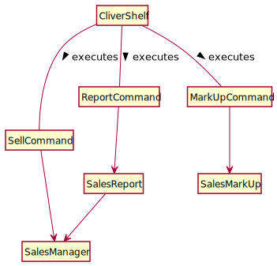

The `Sales` subcomponent,
* When CLIvershelf executes SellCommand, SellCommand calls the SalesManager to mark the item as sold.
* When CLIvershelf executes MarkUpCommand, MarkUpCommand calls the SalesMarkUp to get markup information about the selected item. 
* When CLIvershelf executes ReportCommand, ReportCommand calls the SalesReport to execute, and SalesReport will in turn 
  call SalesManager to get the list of sold items for further processing. 

For more specific details, refer to implementation of [`SellCommand`](#selling-an-item), [`ReportCommand`](#generating-sales-report), and [`MarkUpCommand`](#generating-item-markup-price). 

### Model component

This sections describes how the classes in model component are structure and how they interact with each other.

**API**:

1. [Item.java](https://github.com/AY2122S1-CS2113T-F11-4/tp/blob/master/src/main/java/seedu/duke/model/Item.java)
    1. A `Item` object stores the information about a product in the bookstore:
        1. `name` of the product, consists of alphabet, number, whitespace, underscore and round bracket. e.g., Time
           Magazine.
        2. `purchaseCost`, the non-negative price the bookstore owner paid for the product.
        3. `sellingPrice`, the non-negative amount a buyer pays for the product.
2. [Shelf.java](https://github.com/AY2122S1-CS2113T-F11-4/tp/blob/master/src/main/java/seedu/duke/model/Shelf.java)
    1. A `Shelf` object stores `Item` objects.
    2. All `Item` are stored in one and only one of the `Shelf` objects.
    3. A `Shelf` object can be instantiated using the constructor `new Shelf(name: String)`
       or `ShelfList.getShelfList().addShelf(name: String)`
    4. All `Shelf` objets are automatically recorded by `ShelfList` at instantiation.
3. [ShelfList.java](https://github.com/AY2122S1-CS2113T-F11-4/tp/blob/master/src/main/java/seedu/duke/model/ShelfList.java)
    1. The `ShelfList` stores all the shelves' data i.e., all `Shelf` objects
    2. `ShelfList` is implemented using Singleton Pattern. The single instance can be obtained
       using `ShelfList.getShelfList()`

The Class Diagram below illustrates how the model components interacts with each other.

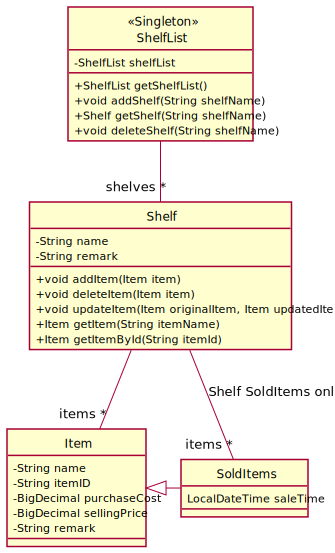

The Object Diagram below illustrates a sample state of the components.

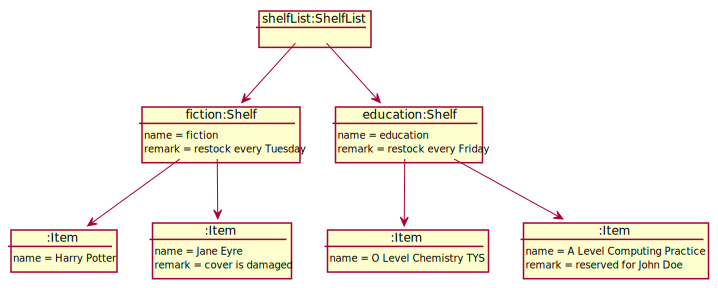

The Sequence Diagram below illustrates how `Shelf` and `ShelfList` interacts when different `Shelf` instantiation
methods are used.

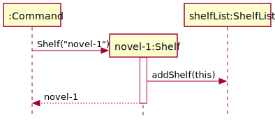
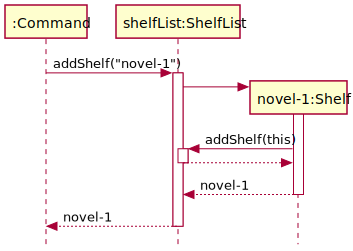

### Storage component

The storage component consists of `Storage` class. It handles the saving of user data by the command component and also
loading data on program start up.

The diagram below shows how `Storage` interacts with [`model`](#model-component) during `saveData()`.


The diagram below shows how `Storage` interacts with [`model`](#model-component) during `loadData()`

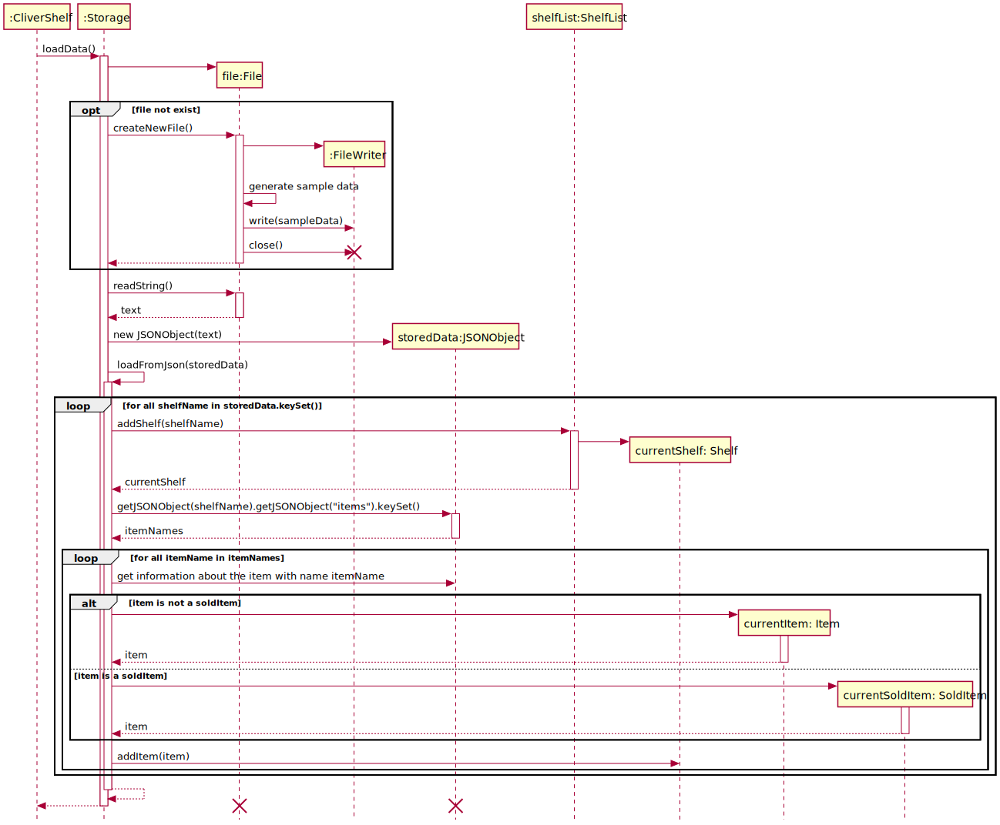

## Implementation

### Adding an item

The sequence diagram below shows the interactions of different subcomponents of the system when adding an item to the
shelf.


The user can add new items to a shelf by specifying the number of items, item details and the name of shelf to add to.

1. As mentioned in the "Design" section, the `Parser` parses user input and returns the new `AddCommand` object to the
   'CLIverShelf'.
2. The `CLIverShelf` then invokes the `execute()` method of the `AddCommand` object.
3. The `AddCommand` object instantiates a new `item` object. It also invokes the `getShelf(shelfName: String)` method of
   the global `ShelfList` to get the specified `Shelf` object. Then, it calls the `addItem(newItem: Item)` method of
   the `Shelf` object to add the new `item` to this specific `Shelf`.
4. If the specified shelf does not exist, then the user cannot add new items. A new shelf should be first created
   using `CreateShelfCommand`.

#### Design considerations:

* Aspect: How to set up the shelf to add to
    * Alternative 1 (current choice): User needs to ensure that the shelf exists before adding new items, or the
      addition will not be successful. No automatic creation of shelves is allowed.
        * Pros: Better control of the shelves.
        * Cons: User needs to create a shelf first.
    * Alternative 2: If the shelf does not exist, the shelf with the name specified by the user will be automatically
      added.
        * Pros: More convenient as creation of shelf is automatic.
        * Cons: Can result in accidental addition of shelves of unwanted names (if the user typed in wrongly).

### Editing an item


The user can edit the property of an item in a shelf by specifying shelf name, item index, property to edit and new
value.

1. The `CLIverShelf` invokes the `execute()` method of the `EditCommand` object.
2. The `EditCommand` object calls the `getShelf(shelfName: String)` method of the global `ShelfList` to get the
   specified shelf.
3. If the shelf exists, the `EditCommand` object will invoke the `getItem(index: int)` method to get the selected item
   to update from the shelf. Then, the `EditCommand` object will call the `setPurchaseCost(newValue: String)`
   or `setSellingPrice(newValue: String)` or `setRemarks(newValue: String)` of the `Item` object to to set the purchase
   cost, selling price or remarks of the item.
4. If the specified shelf does not exist, the editing operation will fail.

#### Design considerations:

* Aspect: How to change a certain property precisely
    * Alternative 1 (current choice): Let the user specify which property to edit, and have setProperty methods for each
      property in the code.
        * Pros: Only need to change one property.
        * Cons: Need one additional step to check which property is selected by the user.
    * Alternative 2: Let the user specify the new values for all properties just like adding a new item.
        * Pros: The user can change multiple properties at once using only one EditCommand.
        * Cons: Longer input is needed from the user even if he/she just wants to change one property.

### Listing all items

The diagram below shows the sequence diagram for ListCommand, which is responsible for listing the items in the shelves.


A user can choose to either list out all the items in the bookstore (i.e. every shelf), or within a specific shelf.

* If user wishes to list out all items within a **specific** shelf:
    1. He keys in `list shlv/[SHELF_NAME]`
    2. This invokes `Parser#parseCommand()`, and since the command argument is `list`, it will further
       invoke `Parser#prepareList()`.
    3. It will then construct a command `ListCommand` using `ListCommand(shelf: String)`, returning it back
       to `CLIverShelf`.
    4. Back in `CLIverShelf`, `ListCommand#execute()` is invoked and since `ListCommand(shelf: String)` is constructed,
       condition for `toPrintAll` is set to `false` and not satisfied. This invokes `ListCommand#getOneList()`
    5. The string result output is then passed back to `CLIverShelf`.


* If user wishes to list out all the items in the bookstore:
    1. He keys in: `list`.
    2. This invokes `Parser#parseCommand()`, and since the input is `list` it will further invoke `Parser#prepareList()`
       .
    3. It will then construct a command `ListCommand` using `ListCommand()`, returning it back to `CLIverShelf`.
    4. Back in `CLIverShelf`, `ListCommand#execute()` is invoked, and since `ListCommand()` is constructed, condition
       for `toPrintAll` is set to `true` and satisfied. This invokes `ListCommand#getEveryList()`
    5. The string result output is then passed back to `CLIverShelf`.

The Class Diagram below illustrates how the components work together in `ListCommand`

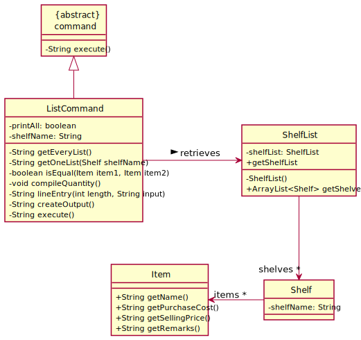

#### Design considerations:

* Aspect: Indexes of items on the list are not in single sequential order (i.e 1, 2, 3...)
    * Alternative 1 (current choice): Identical items are grouped together into a single entry, with their indexes being
      printed as a range. (e.g. First entry of 5 identical items on the list will be grouped as index "001-005", instead
      of "1")
        * Pros: User can use `delete` or `edit` on a single item, instead of the whole group of identical items
          together (e.g. If there are 5 identical items, but you only want to change 1 of them because perhaps they are
          damaged, and you want to add a remark)
        * Cons: Looks less user-friendly
    * Alternative 2: The indexes of the list are printed in single sequential order.
        * Pros: Looks a lot neater as there is only 1 number instead of a range of numbers
        * Cons: User is unable to `delete` or `edit` a singular item.

### Selling an item

The sequence diagram below shows how the feature of selling an item (SellCommand) is implemented.


1. When program invokes `SellCommand#execute()`, `SellCommand` object validates the itemID from user input by trying to 
   get the item from the `ShelfList` through `ShelfList#getItem(itemID)`.
2. Once it gets the item, `SellCommand` calls `SalesManager#sell()` to mark the item as sold.
   <br> In `SalesManager#sell()`: 
   1. It will try to get the `originalShelf` where the item to be sold belongs to
   2. Then delete the sold item from the `originalShelf` by the shelf name
   3. The function will first prepare to store the details of the soldItem 
      * By calling `ShelfList#getShelf("soldItems")` to get the shelf called `soldItems` represented by `soldItemsShelf` 
         to store the records of all soldItems.
      * Also, details of Item to be sold will be constructed as a new `SoldItem` object, represented by `newSoldItem`
   4. The `newSoldItem` will then be added to the `soldItemsShelf` via `Shelf#addItem(newSoldItem)`.
3. Once the above steps are done, `SalesManager` will return a `finishedMessage`, which will then be passed back to 
   `CLIverShelf` for printing.

#### Design considerations:

* Aspect: How to determine the sale time
    * Alternative 1 (current choice): Use the system time when the user sold the item.
        * Pros: Does not need one additional parameter (sale time) from the user. Shorter command for the user.
        * Cons: Does not allow the user to manually set the sale time. Not very flexible for the user if he/she forgot
          to sell an item and wants to make up for it later on.
    * Alternative 2: Requires the user to specify the sale time.
        * Pros: More flexibility for the user to add on sale records that he/she forgot to add.
        * Cons: Needs one additional parameter from the user. Longer command.

### Generating sales report

This section will describe how the feature generating a sales report (ReportCommand) is implemented.

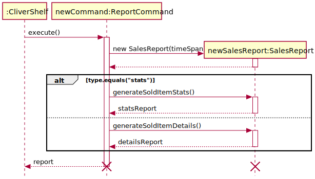

The simplified overview of report implementation is as follows: 

1. `CLIverShelf` invokes `ReportCommand#execute()`
2. A `SalesReport` object which is named `newSalesReport` is created
3. If the type specified in user input is `stats`, `SalesReport#generateSoldItemStats()` is called to get a string of
   sold item statistics represented by `statsReport` in the diagram.
4. Else, `SalesReport#generateSoldItemDetails()` will be called to get the filtered SoldItem list in the form of a string 
   before returning the String to `CLIverShelf` for printing.

The below diagram shows a more in-depth implementation of report feature. 

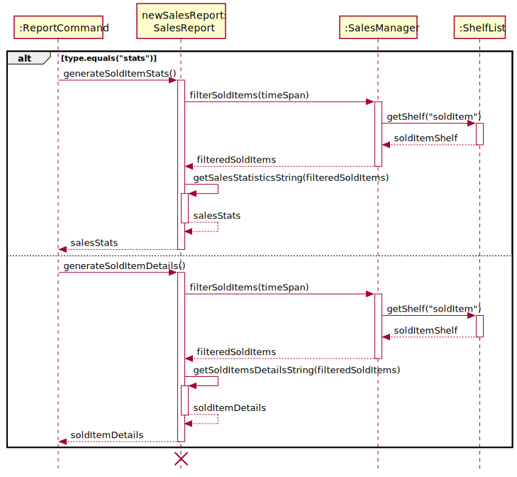

The more detailed inner workings of the report implementation is as follows:

* Case 1: user specifies `stats` for type.
  1. `ReportCommand#generateSoldItemStats()` is executed.
  2. `SalesManager#filterSoldItems(timeSpan)` is called.
  3. `SalesManager` will call `ShelfList#getShelf("soldItems")`, which returns a `soldItemShelf`.
  4. `SalesManager` filters the items from `soldItemShelf` according to the `timeSpan`, 
     & returns the list named `filteredSoldItems` which represents the list of `soldItems` named from that `timeSpan`.
  5. `SalesReport` will then self invoke `SalesReport#getSalesStatisticsString(filteredSoltItems)` to calculate the 
     relevant statistical information needed, and returns a formatted string `salesStats`.
  6. `SalesReport` will return `salesStats` to `ReportCommand`.

* Case 2: user specifies `items` for type
  1. `ReportCommand#generateSoldItemDetails()` is executed.
  2. Same as step 2 of case 1
  3. Same as step 3 of case 1
  4. Same as step 4 of case 1
  5. `SalesReport` will then self invoke `SalesReport#getSoldItemsDetailsString(filteredSoldItems)` to 
     get the formatted string `soldItemDetails` containing information about `SoldItem` details from `filteredSoldItems`.
  6. `SalesReport` will return `soldItemDetails` to `ReportCommand`.

#### Design considerations:

* Aspect how to show the report stats or items within a time period
  * Alternative 1 (current choice): Convert YEAR-MONTH input string to YearMonth object to check valid year and month 
    * Pros: Able to use pre-written YearMonth class methods, to simplify verification of year & month input 
      And also simple check if the YearMonth input is in correct order
    * Cons: Have to implement valid year restriction since, the max year accepted is a very large integer.
  * Alternative 2: check the and the input manually by extracting the year and the month from the string, 
    then converting to integer for validity checking
      * Pros: Able to have flexibility in terms of more restrictions for valid year e.g. starting from year 1970
      * Cons: More lines of code due to more factors to consider for checking if the year and month are valid
        This makes code messier, increases debugging efforts & number of unit test cases. 

### Generating item markup price

This section will illustrate how the marking up of an item price (MarkUpCommand) is being implemented.

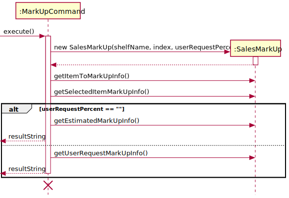

A user may choose to check the estimated marked up price of an item, given a specific mark up percentage.

1. After user input is parsed, a `MarkUpCommand` object is constructed & returned to `CLIvershelf`.
2. CLIverShelf invokes `MarkUpCommand#execute()`
   1. A `SalesMarkUp` Object is constructed,
   2. Then `SalesMarkUp#getItemToMarkUpInfo()` is called
   3. followed by `SalesMarkUp#getSelectedItemMarkUpInfo()` to get the relevant information about the selected item
       1. If `userRequestPercent` not specified in input, `MarkUpCommand#execute()` calls `SalesMarkUp#getEstimatedMarkUpInfo()` 
          which get the markup in percentage intervals of 20, returned as a string
       2. Else, `SalesMarkUp#getUserRequestMarkUpInfo()` is called to get the requested user percentage mark up
          information, returned as a string
   4. All the strings received from calling functions in `SalesMarkUp`, will be appended and returned to `CLIvershelf`
      as a `resultString` for printing.

#### Design considerations:

Aspect: How markup executes:

* Alternative 1 (current choice): SalesMarkup is a separate class from SalesManager.
    * Pros: Increases cohesiveness. Easier testing efforts.
    * Cons: More code written.

* Alternate 2: SalesMarkUp functions can be integrated with SalesManager class. However, having more methods in the same
  class
    * Pros: All methods in the same class, lesser additional code.
    * Cons: Reduces cohesiveness. Increases testing efforts as more methods in the same class to be tested which could
      be more complicated.

## Product scope

This section defined the target users, and the value proposition.

### Target user profile

* has a need to manage inventories & finances of small scaled book stores
* prefers to operate the store by themselves without additional hires
* prefers typing to clicking on GUI applications
* ability to type fast
* comfortable with command line applications
* does not mind the plain output from command line applications

### Value proposition

Allows efficient and simplified management of inventory and finances of the store

## User Stories

|Version| As a ... | I want to ... | So that I can ...|
|--------|----------|---------------|------------------|
|v1.0|new user|see usage instructions|refer to them when I forget how to use the application|
|v1.0|user|add new items to inventory list||
|v1.0|user|delete items from inventory list|remove entries that I no longer need|
|v1.0|user|get a list of inventory according to their category|keep track of what I have in stock for selling|
|v1.0|user|retrieve information about an item|decide if I need to restock|
|v1.0|user|update the information of the items|keep the list updated|
|v2.0|user|store and retrieve the inventory list|save the data when program closes and automatically loads when program restarts|
|v2.0|user|retrieve a list of items low in stock|replenish items low in stock|
|v2.0|user|mark an item as sold|remove item from inventory list and add to revenue|
|v2.0|user|add the total cost of all the items|know the total cost and deduct from revenue to find profit|
|v2.0|user|view the monthly sales report|know if I am making a profit|
|v2.0|user|create a shelf|store items into the shelf|
|v2.0|user|remove a shelf|remove the shelf if the shelf is empty|
|v2.0|user|view the estimated markup price for an item|know the percentage returns i can get from the markup|
|v2.0|user|search for an item with very little information about it|find an item even if I can only remember very little information about it
|v2.0|user|search for an item with incomplete information|know which book an broken ID tag belongs to
|v2.0|user|search for all items that contains the same remark information|know all the books that has the same remark, for example, damaged

## Non-Functional Requirements

1. Should work on mainstream OS such as Windows and Linux as long as it has Java 11 or above installed.
2. Users with fast typing speed should be able to accomplish tasks faster using commands than using the mouse
3. Users should be able to easily understand the command formats in the User Guide and use the commands to accomplish
   the tasks.
4. Users should be able to see improvements in terms of the efficiency and management of the bookstore within a months
   of using the app.

## Glossary

* *Mainstream OS* - macOS, Windows, Linux, Unix

## Instructions for manual testing

Given below are the instructions to test the app manually.

&#8505; **Note:** These instructions only provide a base of how the app is currently being tested by the developing
team. These test cases may and may not cover all possible outcomes. You are welcome to do more exploratory testing.
Should there be any bugs, please do contact
the [developing team](https://ay2122s1-cs2113t-f11-4.github.io/tp/AboutUs.html).

* [Launch and shut down](#launch-and-shut-down)
* [Getting help test](#getting-help-test)
* [Creating a shelf test](#creating-a-shelf-test)
* [Removing a shelf test](#removing-a-shelf-test)
* [Adding an item test](#adding-an-item-test)
* [Deleting an item test](#deleting-an-item-test)
* [Getting information of an item test](#getting-information-of-an-item-test)
* [Listing the items test](#listing-the-items-test)
* [Editing an item test](#editing-an-item-test)
* [Getting a Report test](#getting-a-report-test)
* [Selling an item test](#selling-an-item-test)
* [Markup price of an item test](#markup-price-of-an-item-test)

### Launch and shut down

This section describes the steps to run and exit the program.

#### Initial launch

1. Download and save the latest JAR file in a desired file directory.
2. Open up your terminal and navigate to where that directory is saved.
3. Run `java -jar Duke.jar` to launch the program.
4. A `data` folder containing `output.txt` is expected to appear.

#### Subsequent launch

1. Open up your terminal and navigate to where the directory in which the JAR file is saved under.
2. Run `java -jar Duke.jar` to launch the program.
3. Data will be automatically saved into the data file.

#### Shut down

1. To terminate the program, type `bye`.
2. Data will be automatically saved into the data file.
3. The data is expected to still be saved normally even if program crashes.

### Getting help test

1. To get help information, type `help`.

### Creating a shelf test

* Format: `create shlv/SHELF_NAME`
* Pre-requisite: Shelf name to be created must not exist.

| Test Case  | Command | Expected Result|
| ------------- | ------------- | ------------- |
| Create shelf | `create shlv/book1` | Shows shelf created message |
| Create shelf that exists | `create shlv/SHELF_NAME` | Error message (Shelf name already exists) |
| Create shelf name with special characters | `create shlv/invest$$booksshelf` | Error message (shelf name cannot contain special characters) |
| Missing parameters | `create` | Error message (invalid format) |

### Removing a shelf test

* Format: `remove shlv/SHELF_NAME`
* Pre-requisite: Shelf name to be removed needs to be created first.

| Test Case  | Command | Expected Result|
| ------------- | ------------- | ------------- |
| Remove shelf | `remove shlv/book1` | Shows shelf removed message |
| Remove non-existent shelf | `remove shlv/nonexistentshelf` | Error message (shelf does not exist) |
| Missing parameters | `remove` | Error message (invalid format) |

### Adding an item test

* Format: `add n/NAME shlv/SHELF_NAME p/PURCHASE_PRICE s/SELLING_PRICE q/QUANTITY [r/REMARKS]`
* Pre-requisite: A shelf must first exist for any item to be added to a shelf.

| Test Case  | Command | Expected Result|
| ------------- | ------------- | ------------- |
| Add an item to an existing shelf|`add n/Harry Potter I shlv/book1 p/11 s/22 q/1`|Shows item added message and item ID|
| Add multiple items to an existing shelf|`add n/Harry Potter I shlv/book1 p/11 s/22 q/10`|Shows item added message|
| Add an item to an non-existent shelf|`add n/Harry Potter I shlv/non_existent p/11 s/22 q/1`|Error message (shelf does not exist)|
| Add an item with invalid properties to an existing shelf |`add n/Harry Potter I shlv/non_existent p/-11 s/22 q/1`| Error message (invalid format) |
| Missing parameters | `add n/aaaa shlv/book1 p/15 s/17` | Error message (invalid format) |

### Deleting an item test

* Format: `delete shlv/SHELF_NAME i/INDEX`
* Pre-requisite: A shelf must first contain the item to be deleted.

| Test Case  | Command | Expected Result|
| ------------- | ------------- | ------------- |
| Delete an item from an existing shelf | `delete shlv/book1 i/1`| Shows item deleted message with details of the deleted item|
| Delete an item from an non-existent shelf | `delete shlv/non_existent i/1`| Error message (shelf does not exist)|
| Delete a non-existent item from a shelf | `delete shlv/book1 i/5` (book1 only has 4 items)| Error message (item does not exit)|
| Missing parameters | `delete shlv/book1` | Error message (invalid format) |

### Getting information of an item test

* Format: `get shlv/SHELF_NAME i/INDEX`
* Pre-requisite: A shelf must first contain the item which the user wants to know more about.

| Test Case  | Command | Expected Result|
| ------------- | ------------- | ------------- |
| Getting item within list | `get shlv/book1 i/2` | Shows information of item |
| Getting item within list | `get shlv/book1 i/002` | Shows information of item |
| Index of item not within list | `get shlv/book1 i/12313123` | Error message showing item with index not in list |
| Getting item from non-existent shelf | `get shlv/nonexistentshelf i/2` | Error message showing shelf does not exist |
| Invalid parameters | `get shlv/book1 i/hello` | Error message (invalid format) |
| Missing flag| `get shlv/book1 2` | Error message (invalid format) |
| Missing parameters | `get shlv/book1` | Error message (invalid format) |

### Listing the items test

* Format: `list [shlv/SHELF_NAME]`
* Pre-requisite: None

| Test Case  | Command | Expected Result|
| ------------- | ------------- | ------------- |
| Listing out for existent shelf| `list shlv/existentshelf` | List of all items in that shelf |
| Listing out for every shelf | `list` | Listing of all items in every shelf bookstore |
| Non-existent shelf | `list shlv/nonexistshelf` | Error message prompting to create shelf first |
| Missing flag | `list book1` | Error message (invalid format) |
| Invalid parameters | `list shlv/&` | Error message (invalid format) |
| Missing parameters | `list shlv/` | Error message (invalid format) |

### Editing an item test

* Format: `edit shlv/SHELF_NAME i/INDEX p/PROPERTY v/VALUE`
* Pre-requisite: At least one item has to be added to any shelf.

| Test Case  | Command | Expected Result|
| ------------- | ------------- | ------------- |
| Edit the purchase cost of an item|`edit shlv/stationary1 i/1 p/purchase cost v/1`| Shows item updated message |
| Edit the selling price of an item|`edit shlv/stationary1 i/1 p/selling price v/1`| Shows item updated message |
| Edit the remarks of an item|`edit shlv/stationary1 i/1 p/remarks v/good pen`| Shows item updated message |
| Edit the selling cost of an item in a non-existent shelf|`edit shlv/non_existent i/1 p/purchase cost v/1`|Error message (shelf does not exist)|
| Edit the selling cost of a non-existent item|`edit shlv/stationary1 i/10 p/purchase cost v/1` (stationary1 only has 5 items)|Error message (item does not exist|
| Edit a non-existent property of an item|`edit shlv/non_existent i/1 p/weight v/1`|Error message (invalid format)|
| Missing parameters | `edit shlv/book1 i/1 v/0.2` | Error message (invalid format) |

### Getting a Report test

* Format: `report t/CONTENT_TYPE ym/START-YEAR-MONTH [ym/END-YEAR-MONTH]`
* Pre-requisite: Some items must be sold first to view the report with data.
* Note: There are only 2 content type:
    * `t/stats` which will give the statistics of the Sales
    * `t/items` which will give the items sold.

| Test Case  | Command | Expected Result|
| ------------- | ------------- | ------------- |
| Statistics report  | `report t/stats ym/2021-10`  | shows statistics for Oct 2021 |
| Items report  | `report t/items ym/2021-10`  | shows items sold for Oct 2021 |
| Items report in between time period | `report t/items ym/2021-10 ym/2021-11` | shows items sold between Oct 2021 and Nov 2021 inclusive |
| Report in invalid year-month | `report t/items ym/0000-10`  | shows invalid year error |
| Report in year-month that does not have items sold | `report t/items ym/2010-10`  | Shows no items sold in Oct 2010 |
| Report in between a time period that does not have items sold | `report t/items ym/1970-01 ym/2010-10` | Shows no items sold in between Jan 1970 and Oct 2010 |
| Time YearMonth not in chronological order | `report t/items ym/2021-11 ym/2021-01` | Error message (parameters are swapped)  |
| Missing parameters  | `report t/items` | Error message (invalid format) |
| Invalid date format  | `report t/items ym/21-10`  | Error message (invalid format) |

### Selling an item test

* Format: `sell id/ITEM_ID`
* Pre-requisite: There must be items added to a shelf first. And user needs to know the `ITEM_ID` through `get`
  or `list` command.
    * Note: replace the id in first test case with an id that exist in ur program run, as the id is can change depending
      on the local machine that the program is being executed on.

| Test Case  | Command | Expected Result|
| ------------- | ------------- | ------------- |
| Sell item (id exists) | `sell id/76e9d234` | Shows item sold |
| Sell item (id does not exists) | `sell id/ffffffff` | Error message (can't find item with that id) |
| Missing Parameters | `sell` | Error message (invalid format) |

### Markup price of an item test

* Format: `markup shlv/SHELF_NAME i/INDEX [%/PERCENT_MARKUP]`
* Pre-requisite: There must be items added to a shelf first.

| Test Case  | Command | Expected Result|
| ------------- | ------------- | ------------- |
| Percent Markup not specified | `markup shlv/book1 i/1` | shows estimated user markup in multiples of 20 till max of 100% |
| Normal percent markup less than 999.99 | `markup shlv/book1 i/1 %/5` | Shows current item markup & the final estimated price after user markup percent |
| Percent markup more than 2 dp | `markup shlv/book1 i/1 %/5.001` | Error message (invalid format) |
| Percent markup more than 1000 percent | `markup shlv/book1 i/1 %/1234.67` | Error message (invalid format) |
| Non-existent shelf | `markup shlv/notexistshelf i/1 %/12.34` | Error message (shelf does not exist) |
| Index out of bounds | `markup shlv/book1 i/999 %/12.34` | Error message (item at index not found) |
| Missing Parameters | `markup shlv/book1 %/9` | Error message (invalid format) |
